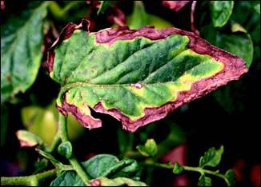
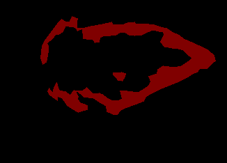

# 🌿 Leaf Disease Segmentation with U-Net and Streamlit

This project uses deep learning to detect and segment disease-affected areas in plant leaves using a U-Net architecture. The goal is to assist in early disease detection and support precision agriculture using an interactive web interface built with Streamlit.

---

## 🚀 Project Overview

**Leaf Disease Segmentation** is a computer vision project that:
- Trains a **U-Net model** on images of plant leaves and their corresponding disease masks.
- Takes a new leaf image as input and outputs a **segmentation mask** highlighting the diseased area.
- Provides an easy-to-use **web app** interface with Streamlit for uploading and predicting on new images.

---

## 🧠 Model Architecture

- **U-Net**: A convolutional neural network architecture that excels at semantic segmentation tasks. It uses an encoder-decoder structure with skip connections, making it ideal for biomedical and leaf disease segmentation.

---

## 💻 Streamlit Web App Features

- 📷 Upload a leaf image from your device.
- ⚙️ Predict the disease-affected region using a pre-trained U-Net model.
- 🖼️ Display original image + predicted mask side-by-side.
- 🌐 Run locally or deploy to [Streamlit Cloud](https://streamlit.io/cloud).

---

## 📸 Example

Below is an example of the model's input and output:

| Leaf Image | Ground Truth Mask |
|------------|-------------------|
|  |  |

---

## 📦 Installation

### 1. Clone the Repository

```bash
git clone https://github.com/ghassenSW/leaf_disease_segmentation.git
cd leaf_disease_segmentation
